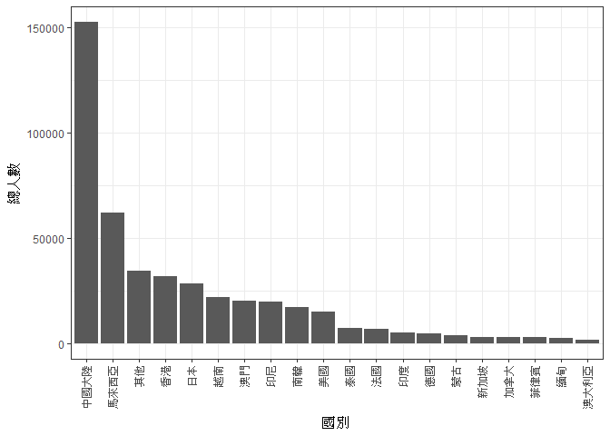
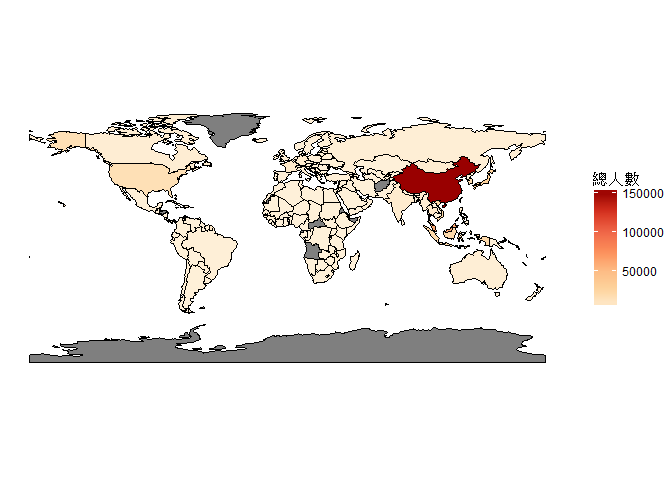
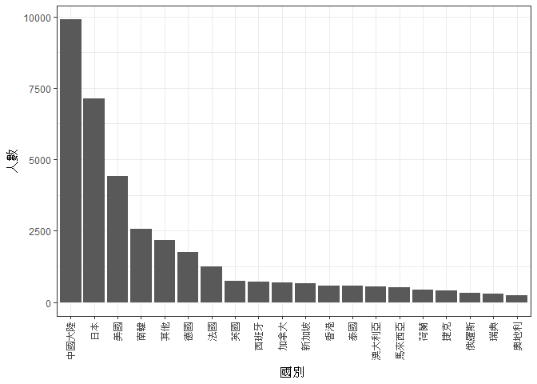
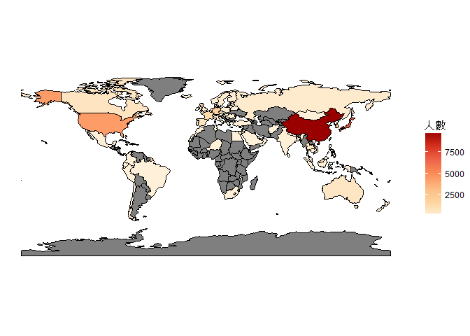
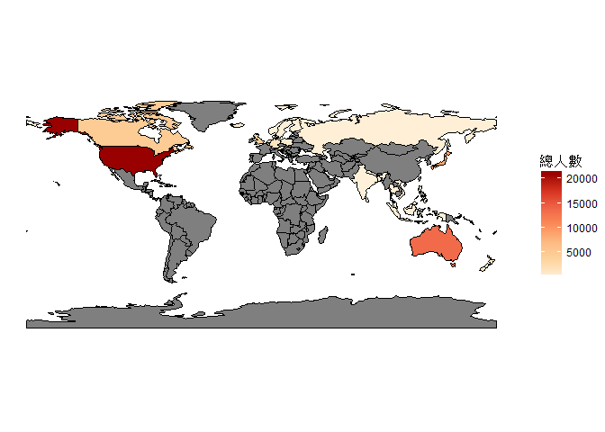
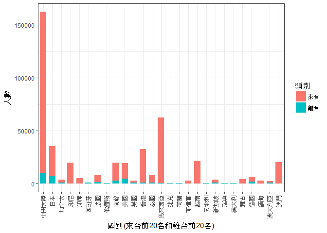

106-2 大數據分析方法 作業二
================
B0444102嚴信虹

作業完整說明[連結](https://docs.google.com/document/d/1aLGSsGXhgOVgwzSg9JdaNz2qGPQJSoupDAQownkGf_I/edit?usp=sharing)

學習再也不限定在自己出生的國家，台灣每年有許多學生選擇就讀國外的大專院校，同時也有人多國外的學生來台灣就讀，透過分析[大專校院境外學生人數統計](https://data.gov.tw/dataset/6289)、[大專校院本國學生出國進修交流數](https://data.gov.tw/dataset/24730)、[世界各主要國家之我國留學生人數統計表](https://ws.moe.edu.tw/Download.ashx?u=C099358C81D4876CC7586B178A6BD6D5062C39FB76BDE7EC7685C1A3C0846BCDD2B4F4C2FE907C3E7E96F97D24487065577A728C59D4D9A4ECDFF432EA5A114C8B01E4AFECC637696DE4DAECA03BB417&n=4E402A02CE6F0B6C1B3C7E89FDA1FAD0B5DDFA6F3DA74E2DA06AE927F09433CFBC07A1910C169A1845D8EB78BD7D60D7414F74617F2A6B71DC86D17C9DA3781394EF5794EEA7363C&icon=..csv)可以了解103年以後各大專院校國際交流的情形。請同學分析以下議題，並以視覺化的方式呈現分析結果，呈現103年以後大專院校國際交流的情形。

來台境外生分析
--------------

### 資料匯入與處理

``` r
#載入package
library(readr)
library(dplyr)
library(ggplot2)
library(jsonlite)
library(rgdal)
library(rgeos)
library(maptools)
library(RColorBrewer)

#讀取資料
#大專校院境外學生人數統計
overseasStudentCountry103<-read_csv("http://stats.moe.gov.tw/files/detail/103/103_ab103_C.csv")
overseasStudentCountry104<-read_csv("http://stats.moe.gov.tw/files/detail/104/104_ab104_C.csv")
overseasStudentCountry105<-read_csv("http://stats.moe.gov.tw/files/detail/105/105_ab105_C.csv")
overseasStudentCountry106<-read_csv("http://stats.moe.gov.tw/files/detail/106/106_ab105_C.csv")
overseasStudentSchool103<-read_csv("http://stats.moe.gov.tw/files/detail/103/103_ab103_S.csv")
overseasStudentSchool104<-read_csv("http://stats.moe.gov.tw/files/detail/104/104_ab104_S.csv")
overseasStudentSchool105<-read_csv("http://stats.moe.gov.tw/files/detail/105/105_ab105_S.csv")
overseasStudentSchool106<-read_csv("http://stats.moe.gov.tw/files/detail/106/106_ab105_S.csv")

#欄位名稱處理_國別資料
ColName<-colnames(overseasStudentCountry103)
ColName<-gsub("-","_",ColName)
colnames(overseasStudentCountry103)<-ColName
colnames(overseasStudentCountry104)<-ColName

#表格合併_國別資料
overseasStudentCountry<-rbind(overseasStudentCountry103,
                              overseasStudentCountry104,
                              overseasStudentCountry105,
                              overseasStudentCountry106)

#欄位名稱處理_校別資料
ColName<-colnames(overseasStudentSchool103)
ColName<-gsub("-","_",ColName)
colnames(overseasStudentSchool103)<-ColName
colnames(overseasStudentSchool104)<-ColName

#表格合併_校別資料
overseasStudentSchool<-rbind(overseasStudentSchool103,
                             overseasStudentSchool104,
                             overseasStudentSchool105,
                             overseasStudentSchool106)

#資料清洗和字串轉數字_校別資料
overseasStudentSchool$非學位生_大陸研修生<-gsub("…","NA",overseasStudentSchool$非學位生_大陸研修生)
overseasStudentSchool$非學位生_大陸研修生<-as.numeric(overseasStudentSchool$非學位生_大陸研修生)
```

### 哪些國家來台灣唸書的學生最多呢？

``` r
ToTWNCountry<-overseasStudentCountry%>%
  mutate(總數=學位生_正式修讀學位外國生+
              `學位生_僑生(含港澳)`+
              學位生_正式修讀學位陸生+
              非學位生_外國交換生+
              非學位生_外國短期研習及個人選讀+
              非學位生_大專附設華語文中心學生+
              非學位生_大陸研修生+
              非學位生_海青班+
              境外專班)%>%
  group_by(國別)%>%
  summarise(總人數=sum(總數))%>%
  arrange(desc(總人數))

#顯示結果前10筆
knitr::kable(head(ToTWNCountry,10))
```

| 國別     | 總人數 |
|:---------|:------:|
| 中國大陸 | 152524 |
| 馬來西亞 |  62031 |
| 香港     |  31940 |
| 日本     |  28200 |
| 越南     |  21670 |
| 澳門     |  20302 |
| 印尼     |  19620 |
| 南韓     |  16948 |
| 美國     |  14846 |
| 泰國     |  7035  |

### 哪間大學的境外生最多呢？

``` r
ToTWNUniversity<-overseasStudentSchool%>%
  mutate(總數=rowSums(.[4:12],na.rm=T))%>%
  group_by(學校名稱)%>%
  summarise(總人數=sum(總數))%>%
  arrange(desc(總人數))%>%
  filter(總人數<90000) #刪除無法區分校別的列

#顯示結果前10筆
knitr::kable(head(ToTWNUniversity,10))
```

| 學校名稱         | 總人數 |
|:-----------------|:------:|
| 國立臺灣師範大學 |  22113 |
| 國立臺灣大學     |  18199 |
| 中國文化大學     |  16074 |
| 銘傳大學         |  16057 |
| 淡江大學         |  13887 |
| 國立政治大學     |  11626 |
| 國立成功大學     |  10982 |
| 輔仁大學         |  9499  |
| 逢甲大學         |  9474  |
| 中原大學         |  7662  |

### 各個國家來台灣唸書的學生人數條狀圖

``` r
#總人數排序後，第20位之後的國家的總人數加總為其他
ToTWNCountry_20Row<-rbind(top_n(ToTWNCountry,19), #取出前19位的列
                          slice(ToTWNCountry,20:n())%>% #取出20位之後的列，合併為1列"其他"
                            summarise(國別="其他",總人數=sum(總人數)))

ToTWNCountryBar<-ToTWNCountry_20Row%>%
  ggplot(aes(x=reorder(國別,-總人數),y=總人數))+
  geom_bar(stat="identity")+
  theme_bw()+
  theme(axis.text.x = element_text(angle = 90, hjust = 1,vjust=0.4))+
  labs(x="國別")

#顯示結果
ToTWNCountryBar
```



### 各個國家來台灣唸書的學生人數面量圖

``` r
#讀取shapefile
worldMap<-readShapeSpatial("ne_110m_admin_0_countries/ne_110m_admin_0_countries.shp")

#shapefile轉為data.frame
worldMap.df<-fortify(worldMap)

#字串轉數字
worldMap.df$id<-as.numeric(worldMap.df$id)

#建立mydata，包含地區名稱、地區ISO3碼、地區id
mydata<-data.frame(Name=worldMap$NAME_LONG,ISO3=worldMap$ISO_A3,id=seq(0,length(worldMap$ISO_A3)-1))

#因子轉字串和補遺漏值
mydata$ISO3<-as.character(mydata$ISO3)
mydata$ISO3[56]<-"FRA"
mydata$ISO3[119]<-"NOR"

#地圖資料合併mydata(以id為依據，新增地圖名稱欄位、地區ISO3碼欄位)
worldMap.df<-left_join(worldMap.df,mydata,by="id")

#讀取國家中英對照表
countryName<-fromJSON("countries.json")

#國家中英對照表處理(對照表和開放資料的中文地區名稱不一致，以開放資料的地區名稱為依據，修改對照表的地區名稱)
index<-c(2,13,17,40,48,55,73,98,119,120,122,143,153,160,166,177,191,195,199,204,207,209,227,228,229,238)
Name<-c("阿拉伯聯合大公國","澳大利亞","波士尼亞與赫塞哥維納","剛果民主共和國","中國大陸","賽普勒斯","密克羅尼西亞",
        "克羅埃西亞","葛摩聯盟","聖克里斯多福","南韓","馬紹爾群島共和國","馬爾他","納米比亞","納戈爾諾-卡拉巴赫",
        "巴布亞紐幾內亞","塞爾維亞共和國","索羅門群島","新加坡","獅子山共和國","索馬利亞民主共和國","南蘇丹共和國",
        "千里達","吐瓦魯","臺灣","聖文森")
countryName$Taiwan[index]<-Name

#地區資料合併國家中英對照表(以ISO3碼為依據，主要目的為新增中文地區名稱欄位)
worldMap.df<-left_join(worldMap.df,countryName,by="ISO3")

#地區資料選取會用到的欄位
worldMap.df<-worldMap.df%>%
  select(long:ISO3,Taiwan)

#欄位名稱處理
colnames(worldMap.df)[10]<-"國別" 

#地區資料合併開放資料為最終資料(以國別為依據，新增總人數欄位)
final.data<-left_join(worldMap.df,ToTWNCountry,by="國別")

ToTWNCountryMap<-ggplot()+
  geom_polygon(data=final.data,aes(x=long,y=lat,group=group,fill=總人數),color="black",size=0.25)+
  coord_quickmap()+
  scale_fill_gradientn(colours=brewer.pal(7,"OrRd"))+
  theme_void()

#顯示結果，灰色區域為無資料
ToTWNCountryMap
```



台灣學生國際交流分析
--------------------

### 資料匯入與處理

``` r
#讀取資料
#大專校院本國學生出國進修交流數
localStudent<-read_csv("Student_RPT.csv",skip=2)

#欄位名稱處理
ColName<-c("學年度","學期","學校設立別","學校類別","學校代碼","學校名稱","系所代碼","系所名稱","學制",
           "對方學校國別","對方學校中文名稱","對方學校英文名稱","本國學生出國進修、交流人數小計",
           "本國學生出國進修、交流人數_男","本國學生出國進修、交流人數_女")
colnames(localStudent)<-ColName

#刪除統計說明
localStudent<-localStudent[1:35020,]
```

### 台灣大專院校的學生最喜歡去哪些國家進修交流呢？

``` r
#取出國別和人數資料
mydata<-localStudent%>%
  filter(學年度>=103)%>%
  group_by(對方學校國別)%>%
  summarise(人數=sum(`本國學生出國進修、交流人數小計`))%>%
  arrange(對方學校國別)

#國別名稱處理(合併名稱不同但為同一國家的欄位)
#土耳其、土耳其共和國
mydata<-rbind(mydata[grepl("土耳其",mydata$對方學校國別),]%>% #取出含有"土耳其"的列，合併為1列
                summarise(對方學校國別="土耳其",人數=sum(人數)),
              mydata[!grepl("土耳其",mydata$對方學校國別),]) #取出不含有"土耳其"的列
#大陸地區、中國大陸
mydata<-rbind(mydata[grepl("大陸",mydata$對方學校國別),]%>%
                summarise(對方學校國別="中國大陸",人數=sum(人數)),
              mydata[!grepl("大陸",mydata$對方學校國別),])
#丹麥、丹麥王國
mydata<-rbind(mydata[grepl("丹麥",mydata$對方學校國別),]%>%
                summarise(對方學校國別="丹麥",人數=sum(人數)),
              mydata[!grepl("丹麥",mydata$對方學校國別),])
#巴拿馬、巴拿馬共和國
mydata<-rbind(mydata[grepl("巴拿馬",mydata$對方學校國別),]%>%
                summarise(對方學校國別="巴拿馬",人數=sum(人數)),
              mydata[!grepl("巴拿馬",mydata$對方學校國別),])
#比利時，比利時王國
mydata<-rbind(mydata[grepl("比利時",mydata$對方學校國別),]%>%
                summarise(對方學校國別="比利時",人數=sum(人數)),
              mydata[!grepl("比利時",mydata$對方學校國別),])
#立陶宛、立陶宛共和國
mydata<-rbind(mydata[grepl("立陶宛",mydata$對方學校國別),]%>%
                summarise(對方學校國別="立陶宛",人數=sum(人數)),
              mydata[!grepl("立陶宛",mydata$對方學校國別),])
#印尼、印度尼西亞共和國
mydata<-rbind(mydata[grepl("印尼|印度尼西亞",mydata$對方學校國別),]%>%
                summarise(對方學校國別="印尼",人數=sum(人數)),
              mydata[!grepl("印尼|印度尼西亞",mydata$對方學校國別),])
#印度、印度共和國
mydata<-rbind(mydata[grepl("印度",mydata$對方學校國別),]%>%
                summarise(對方學校國別="印度",人數=sum(人數)),
              mydata[!grepl("印度",mydata$對方學校國別),])
#西班牙、西班牙共和國
mydata<-rbind(mydata[grepl("西班牙",mydata$對方學校國別),]%>%
                summarise(對方學校國別="西班牙",人數=sum(人數)),
              mydata[!grepl("西班牙",mydata$對方學校國別),])
#希臘、希臘共和國
mydata<-rbind(mydata[grepl("希臘",mydata$對方學校國別),]%>%
                summarise(對方學校國別="希臘",人數=sum(人數)),
              mydata[!grepl("希臘",mydata$對方學校國別),])
#汶萊、汶萊和平之國
mydata<-rbind(mydata[grepl("汶萊",mydata$對方學校國別),]%>%
                summarise(對方學校國別="汶萊",人數=sum(人數)),
              mydata[!grepl("汶萊",mydata$對方學校國別),])
#拉脫維亞、拉脫維亞共和國
mydata<-rbind(mydata[grepl("拉脫維亞",mydata$對方學校國別),]%>%
                summarise(對方學校國別="拉脫維亞",人數=sum(人數)),
              mydata[!grepl("拉脫維亞",mydata$對方學校國別),])
#波蘭、波瀾共和國
mydata<-rbind(mydata[grepl("波蘭",mydata$對方學校國別),]%>%
                summarise(對方學校國別="波蘭",人數=sum(人數)),
              mydata[!grepl("波蘭",mydata$對方學校國別),])
#芬蘭、芬蘭共和國
mydata<-rbind(mydata[grepl("芬蘭",mydata$對方學校國別),]%>%
                summarise(對方學校國別="芬蘭",人數=sum(人數)),
              mydata[!grepl("芬蘭",mydata$對方學校國別),])
#俄羅斯、俄羅斯聯邦
mydata<-rbind(mydata[grepl("俄羅斯",mydata$對方學校國別),]%>% #會計算到"白俄羅斯共和國"的1人，人數加總後減1
                summarise(對方學校國別="俄羅斯",人數=sum(人數)-1), 
              mydata[!grepl("俄羅斯",mydata$對方學校國別),],
              c("白俄羅斯共和國",1)) #補回"白俄羅斯共和國"的列
#處理完俄羅斯後人數資料型態變為字串，進行字串轉數字
mydata$人數<-as.numeric(mydata$人數)
#南非、南非共和國
mydata<-rbind(mydata[grepl("南非",mydata$對方學校國別),]%>%
                summarise(對方學校國別="南非",人數=sum(人數)),
              mydata[!grepl("南非",mydata$對方學校國別),])
#柬埔寨、柬埔寨王國
mydata<-rbind(mydata[grepl("柬埔寨",mydata$對方學校國別),]%>%
                summarise(對方學校國別="柬埔寨",人數=sum(人數)),
              mydata[!grepl("柬埔寨",mydata$對方學校國別),])
#挪威、挪威王國
mydata<-rbind(mydata[grepl("挪威",mydata$對方學校國別),]%>%
                summarise(對方學校國別="挪威",人數=sum(人數)),
              mydata[!grepl("挪威",mydata$對方學校國別),])
#泰王國、泰國
mydata<-rbind(mydata[grepl("泰國",mydata$對方學校國別),]%>%
                summarise(對方學校國別="泰國",人數=sum(人數)),
              mydata[!grepl("泰國",mydata$對方學校國別),])
#捷克、捷克共和國
mydata<-rbind(mydata[grepl("捷克",mydata$對方學校國別),]%>%
                summarise(對方學校國別="捷克",人數=sum(人數)),
              mydata[!grepl("捷克",mydata$對方學校國別),])
#荷蘭、荷蘭王國
mydata<-rbind(mydata[grepl("荷蘭",mydata$對方學校國別),]%>%
                summarise(對方學校國別="荷蘭",人數=sum(人數)),
              mydata[!grepl("荷蘭",mydata$對方學校國別),])
#斯洛維尼亞、斯洛維尼亞共和國
mydata<-rbind(mydata[grepl("斯洛維尼亞",mydata$對方學校國別),]%>%
                summarise(對方學校國別="斯洛維尼亞",人數=sum(人數)),
              mydata[!grepl("斯洛維尼亞",mydata$對方學校國別),])
#菲律賓、菲律賓共和國
mydata<-rbind(mydata[grepl("菲律賓",mydata$對方學校國別),]%>%
                summarise(對方學校國別="菲律賓",人數=sum(人數)),
              mydata[!grepl("菲律賓",mydata$對方學校國別),])
#越南、越南社會主義共和國
mydata<-rbind(mydata[grepl("越南",mydata$對方學校國別),]%>%
                summarise(對方學校國別="越南",人數=sum(人數)),
              mydata[!grepl("越南",mydata$對方學校國別),])
#奧地利、奧地利共和國
mydata<-rbind(mydata[grepl("奧地利",mydata$對方學校國別),]%>%
                summarise(對方學校國別="奧地利",人數=sum(人數)),
              mydata[!grepl("奧地利",mydata$對方學校國別),])
#愛沙尼亞、愛沙尼亞共和國
mydata<-rbind(mydata[grepl("愛沙尼亞",mydata$對方學校國別),]%>%
                summarise(對方學校國別="愛沙尼亞",人數=sum(人數)),
              mydata[!grepl("愛沙尼亞",mydata$對方學校國別),])
#愛爾蘭、愛爾蘭共和國
mydata<-rbind(mydata[grepl("愛爾蘭",mydata$對方學校國別),]%>%
                summarise(對方學校國別="愛爾蘭",人數=sum(人數)),
              mydata[!grepl("愛爾蘭",mydata$對方學校國別),])
#新加坡、新加坡共和國
mydata<-rbind(mydata[grepl("新加坡",mydata$對方學校國別),]%>%
                summarise(對方學校國別="新加坡",人數=sum(人數)),
              mydata[!grepl("新加坡",mydata$對方學校國別),])
#瑞典、瑞典王國
mydata<-rbind(mydata[grepl("瑞典",mydata$對方學校國別),]%>%
                summarise(對方學校國別="瑞典",人數=sum(人數)),
              mydata[!grepl("瑞典",mydata$對方學校國別),])
#義大利、義大利共和國
mydata<-rbind(mydata[grepl("義大利",mydata$對方學校國別),]%>%
                summarise(對方學校國別="義大利",人數=sum(人數)),
              mydata[!grepl("義大利",mydata$對方學校國別),])
#葡萄牙、葡萄牙共和國
mydata<-rbind(mydata[grepl("葡萄牙",mydata$對方學校國別),]%>%
                summarise(對方學校國別="葡萄牙",人數=sum(人數)),
              mydata[!grepl("葡萄牙",mydata$對方學校國別),])
#蒙古、蒙古國
mydata<-rbind(mydata[grepl("蒙古",mydata$對方學校國別),]%>%
                summarise(對方學校國別="蒙古",人數=sum(人數)),
              mydata[!grepl("蒙古",mydata$對方學校國別),])
#德國、德意志聯邦共和國
mydata<-rbind(mydata[grepl("德國|德意志",mydata$對方學校國別),]%>%
                summarise(對方學校國別="德國",人數=sum(人數)),
              mydata[!grepl("德國|德意志",mydata$對方學校國別),])
#大韓民國(南韓)、南韓
mydata<-rbind(mydata[grepl("南韓",mydata$對方學校國別),]%>%
                summarise(對方學校國別="南韓",人數=sum(人數)),
              mydata[!grepl("南韓",mydata$對方學校國別),])

FromTWNCountry<-mydata%>%
  arrange(desc(人數))

#欄位名稱修改
colnames(FromTWNCountry)[1]<-"國別"

#顯示結果前10筆
knitr::kable(head(FromTWNCountry,10))
```

| 國別     | 人數 |
|:---------|:----:|
| 中國大陸 | 9891 |
| 日本     | 7142 |
| 美國     | 4427 |
| 南韓     | 2565 |
| 德國     | 1764 |
| 法國     | 1258 |
| 英國     |  742 |
| 西班牙   |  721 |
| 加拿大   |  689 |
| 新加坡   |  673 |

### 哪間大學的出國交流學生數最多呢？

``` r
FromTWNUniversity<-localStudent%>%
  filter(學年度>=103)%>%
  group_by(學校名稱)%>%
  summarise(人數=sum(`本國學生出國進修、交流人數小計`))%>%
  arrange(desc(人數))

#顯示結果前10筆
knitr::kable(head(FromTWNUniversity,10))
```

| 學校名稱     | 人數 |
|:-------------|:----:|
| 國立臺灣大學 | 2224 |
| 淡江大學     | 2038 |
| 國立政治大學 | 1876 |
| 逢甲大學     | 1346 |
| 元智大學     | 1106 |
| 國立臺北大學 |  956 |
| 國立交通大學 |  951 |
| 東海大學     |  931 |
| 東吳大學     |  873 |
| 國立成功大學 |  846 |

### 台灣大專院校的學生最喜歡去哪些國家進修交流條狀圖

``` r
#人數排序後，第20位之後的國別的人數加總為其他
FromTWNCountry_20Row<-rbind(top_n(FromTWNCountry,19), #取出前19位的列
                               slice(FromTWNCountry,20:n())%>% #取出20位之後的列，合併為1列"其他"
                                 summarise(國別="其他",人數=sum(人數)))

FromTWNCountryBar<-FromTWNCountry_20Row%>%
  ggplot(aes(x=reorder(國別,-人數),y=人數))+
  geom_bar(stat="identity")+
  theme_bw()+
  theme(axis.text.x = element_text(angle = 90, hjust = 1,vjust=0.4))+
  labs(x="國別")

#顯示結果
FromTWNCountryBar
```



### 台灣大專院校的學生最喜歡去哪些國家進修交流面量圖

``` r
#讀取shapefile
worldMap<-readShapeSpatial("ne_110m_admin_0_countries/ne_110m_admin_0_countries.shp")

#shapefile轉為data.frame
worldMap.df<-fortify(worldMap)

#字串轉數字
worldMap.df$id<-as.numeric(worldMap.df$id)

#建立表格，包含地區名稱、地區ISO3碼、地區id
mydata<-data.frame(Name=worldMap$NAME_LONG,ISO3=worldMap$ISO_A3,id=seq(0,length(worldMap$ISO_A3)-1))

#因子轉字串和補遺漏值
mydata$ISO3<-as.character(mydata$ISO3)
mydata$ISO3[56]<-"FRA"
mydata$ISO3[119]<-"NOR"

#地圖資料合併表格(以id為依據，新增地圖名稱欄位、地區ISO3碼欄位)
worldMap.df<-left_join(worldMap.df,mydata,by="id")

#讀取國家中英對照表
countryName<-fromJSON("countries.json")

#國家中英對照表處理(對照表和開放資料的中文地區名稱不一致，以開放資料的地區名稱為依據，修改對照表的地區名稱)
index<-c(3,13,36,48,98,122,154,191,195,199)
Name<-c("阿富汗伊斯蘭國","澳大利亞","白俄羅斯共和國","中國大陸","克羅埃西亞","南韓","模里西斯共和國",
        "塞爾維亞共和國","所羅門群島","新加坡")
countryName$Taiwan[index]<-Name

#地區資料合併國家中英對照表(以ISO3碼為依據，主要目的為新增中文地區名稱欄位)
worldMap.df<-left_join(worldMap.df,countryName,by="ISO3")

#地區資料選取會用到的欄位
worldMap.df<-worldMap.df%>%
  select(long:ISO3,Taiwan)

#欄位名稱處理
colnames(worldMap.df)[10]<-"國別" 

#地區資料合併開放資料為最終資料(以國別為依據，新增人數欄位)
final.data<-left_join(worldMap.df,FromTWNCountry,by="國別")

FromTWNCountryMap<-ggplot()+
  geom_polygon(data=final.data,aes(x=long,y=lat,group=group,fill=人數),color="black",size=0.25)+
  coord_quickmap()+
  scale_fill_gradientn(colours=brewer.pal(7,"OrRd"))+
  theme_void()

#顯示結果，灰色區域為無資料
FromTWNCountryMap
```



台灣學生出國留學分析
--------------------

### 資料匯入與處理

``` r
#讀取資料
#世界各主要國家之我國留學生人數統計表
country<-read_csv("https://ws.moe.edu.tw/Download.ashx?u=C099358C81D4876CC7586B178A6BD6D5062C39FB76BDE7EC7685C1A3C0846BCDD2B4F4C2FE907C3E7E96F97D24487065577A728C59D4D9A4ECDFF432EA5A114C8B01E4AFECC637696DE4DAECA03BB417&n=4E402A02CE6F0B6C1B3C7E89FDA1FAD0B5DDFA6F3DA74E2DA06AE927F09433CFBC07A1910C169A1845D8EB78BD7D60D7414F74617F2A6B71DC86D17C9DA3781394EF5794EEA7363C&icon=..csv")

#刪除空欄位
country<-country[,1:3]
```

### 台灣學生最喜歡去哪些國家留學呢？

``` r
FromTWNAb<-country%>%
  select("國別","總人數")%>%
  arrange(desc(總人數))

#顯示結果前10筆
knitr::kable(head(FromTWNAb,10))
```

| 國別     | 總人數 |
|:---------|:------:|
| 美國     |  21127 |
| 澳大利亞 |  13582 |
| 日本     |  8444  |
| 加拿大   |  4827  |
| 英國     |  3815  |
| 德國     |  1488  |
| 紐西蘭   |  1106  |
| 波蘭     |   561  |
| 馬來西亞 |   502  |
| 奧地利   |   419  |

### 台灣學生最喜歡去哪些國家留學面量圖

``` r
#讀取shapefile
worldMap<-readShapeSpatial("ne_110m_admin_0_countries/ne_110m_admin_0_countries.shp")

#shapefile轉為data.frame
worldMap.df<-fortify(worldMap)

#字串轉數字
worldMap.df$id<-as.numeric(worldMap.df$id)

#建立表格，包含地區名稱、地區ISO3碼、地區id
mydata<-data.frame(Name=worldMap$NAME_LONG,ISO3=worldMap$ISO_A3,id=seq(0,length(worldMap$ISO_A3)-1))

#因子轉字串和補遺漏值
mydata$ISO3<-as.character(mydata$ISO3)
mydata$ISO3[56]<-"FRA"
mydata$ISO3[119]<-"NOR"

#地圖資料合併表格(以id為依據，新增地圖名稱欄位、地區ISO3碼欄位)
worldMap.df<-left_join(worldMap.df,mydata,by="id")

#讀取國家中英對照表
countryName<-fromJSON("countries.json")

#國家中英對照表處理(對照表和開放資料的中文地區名稱不一致，以開放資料的地區名稱為依據，修改對照表的地區名稱)
index<-c(13,122,199)
Name<-c("澳大利亞","南韓","新加坡")
countryName$Taiwan[index]<-Name

#地區資料合併國家中英對照表(以ISO3碼為依據，主要目的為新增中文地區名稱欄位)
worldMap.df<-left_join(worldMap.df,countryName,by="ISO3")

#地區資料選取會用到的欄位
worldMap.df<-worldMap.df%>%
  select(long:ISO3,Taiwan)

#欄位名稱處理
colnames(worldMap.df)[10]<-"國別" 

#地區資料合併開放資料為最終資料(以國別為依據，新增總人數欄位)
final.data<-left_join(worldMap.df,FromTWNAb,by="國別")

FromTWNAbMap<-ggplot()+
  geom_polygon(data=final.data,aes(x=long,y=lat,group=group,fill=總人數),color="black",size=0.25)+
  coord_quickmap()+
  scale_fill_gradientn(colours=brewer.pal(7,"OrRd"))+
  theme_void()

#顯示結果，灰色區域為無資料
FromTWNAbMap
```



綜合分析
--------

請問來台讀書與離台讀書的來源國與留學國趨勢是否相同(5分)？想來台灣唸書的境外生，他們的母國也有很多台籍生嗎？請圖文並茂說明你的觀察(10分)。

``` r
#複製表格
ToTW<-ToTWNCountry
FromTW<-FromTWNCountry

#欄位名稱處理
ColName<-c("國別","人數")
colnames(ToTW)<-ColName
colnames(FromTW)<-ColName

#表格合併，取來台的前20名國家和離台的前20名國家
mydata<-rbind(top_n(ToTW,20),top_n(FromTW,20))

#表格新增分類
mydata$類別[1:20]<-"來台"
mydata$類別[21:40]<-"離台"

Analysis<-mydata%>%
  ggplot(aes(x=國別,y=人數,fill=類別))+
  geom_bar(stat="identity",width=0.7)+
  theme_bw()+
  theme(axis.text.x = element_text(angle = 90, hjust = 1,vjust=0.4))+
  labs(x="國別(來台前20名和離台前20名)")

#顯示圖表
Analysis
```



根據圖表顯示:<br> 有境外學生來台的國家不一定有台灣學生前往，例如越南、印尼和澳門<br> 有台灣學生前往的國家也不一定有境外學生來台，例如西班牙、俄羅斯和捷克<br>

``` r
#國別名稱修改
ToTW$國別[88]<-"白俄羅斯共和國"
ToTW$國別[155]<-"馬爾他共和國"
ToTW$國別[117]<-"模里西斯共和國"

#境外學生來台國家數
nrow(ToTW)
```

    ## [1] 177

``` r
#台灣學生離台國家數
nrow(FromTW)
```

    ## [1] 82

``` r
#國家總數
mydata<-full_join(ToTW,FromTW,by="國別")
nrow(mydata)
```

    ## [1] 180

``` r
#有境外學生來台又有台灣學生前往國家數
mydata<-inner_join(ToTW,FromTW,by="國別")
nrow(mydata)
```

    ## [1] 79

國家總數(有境外學生來台或台灣學生前往)：180個國家<br> 境外學生來台的國家總數：177個國家<br> 台灣學生前往的國家總數：82個國家<br> 有境外學生來台和台灣學生前往的國家總數：79個國家<br> 有境外學生來台的國家的比例：98%<br> 有台灣學生前往的國家的比例：46%<br> 有台灣學生前往和境外學生來台的國家的比例：44%<br> 根據以上數據，來台讀書與離台讀書的來源國與留學國趨勢不太相同，只有約44%的國家有台灣學生前往和境外學生來台<br>

``` r
#欄位名稱處理
colnames(mydata)<-c("國別","來台人數","離台人數")

Analysis.FromTo<-mydata%>%
  mutate(離台來台人數比=離台人數/來台人數)%>%
  arrange(desc(離台來台人數比))

#顯示表格
knitr::kable(head(Analysis.FromTo,10))
```

| 國別         | 來台人數 | 離台人數 | 離台來台人數比 |
|:-------------|:--------:|:--------:|:--------------:|
| 北韓         |     1    |    16    |   16.0000000   |
| 科威特       |     6    |    33    |    5.5000000   |
| 摩納哥       |     6    |    10    |    1.6666667   |
| 冰島         |    10    |    13    |    1.3000000   |
| 尼日         |     1    |     1    |    1.0000000   |
| 阿曼         |     1    |     1    |    1.0000000   |
| 柬埔寨       |    43    |    41    |    0.9534884   |
| 馬爾他共和國 |     5    |     3    |    0.6000000   |
| 西班牙       |   1390   |    721   |    0.5187050   |
| 沙烏地阿拉伯 |    17    |     8    |    0.4705882   |

根據表格顯示:<br> 有些國家的台灣學生前往的比例遠高於境外學生來台的比例，例如北韓的16、科威特的5.5<br> 有些國家的台灣學生前往的比例大約等於境外學生來台的比例，例如尼日和阿曼的1、柬埔寨的0.95<br>

``` r
Analysis.ToFrom<-mydata%>%
  mutate(來台離台人數比=來台人數/離台人數)%>%
  arrange(desc(來台離台人數比))

#顯示表格
knitr::kable(head(Analysis.ToFrom,10))
```

| 國別           | 來台人數 | 離台人數 | 來台離台人數比 |
|:---------------|:--------:|:--------:|:--------------:|
| 澳門           |   20302  |    57    |    356.1754    |
| 蒙古           |   3843   |    11    |    349.3636    |
| 印尼           |   19620  |    85    |    230.8235    |
| 聖多美普林西比 |    211   |     1    |    211.0000    |
| 史瓦濟蘭       |   1152   |     6    |    192.0000    |
| 越南           |   21670  |    123   |    176.1789    |
| 巴西           |    864   |     5    |    172.8000    |
| 厄瓜多         |    309   |     2    |    154.5000    |
| 斯里蘭卡       |    140   |     1    |    140.0000    |
| 馬來西亞       |   62031  |    509   |    121.8684    |

根據表格顯示:<br> 很多國家的境外學生來台的比例遠高於台灣學生前往的比例，在前10名中的比例都達到了100以上<br> 所以想來台灣念書的境外生，他們母國的台籍生並不多<br>
